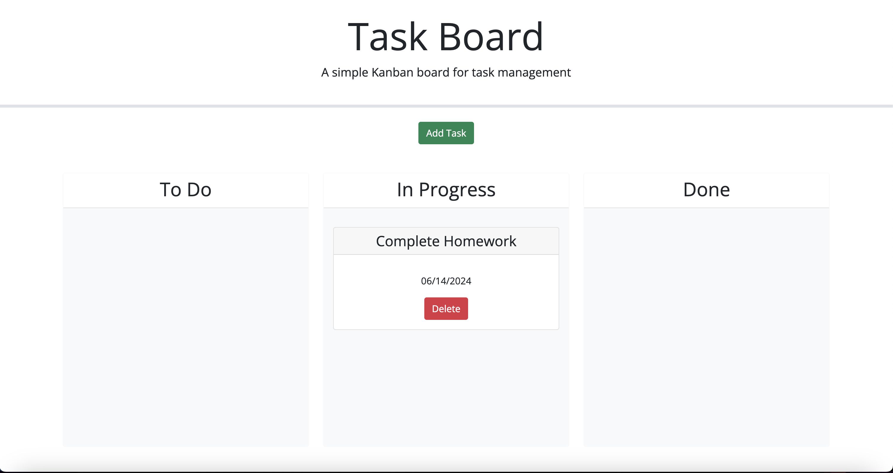

# Task Board

## Description

This project was created in order to help people better organize their tasks and keep track of due dates. The color code system is am additional tool to keep on top of tasks.

## Usage

To use my application, click on the green "Add Task" button and input your information. Click save and move your task around based on your progress.
    md  
    
   

## Credits

Source code via bootcamp.
